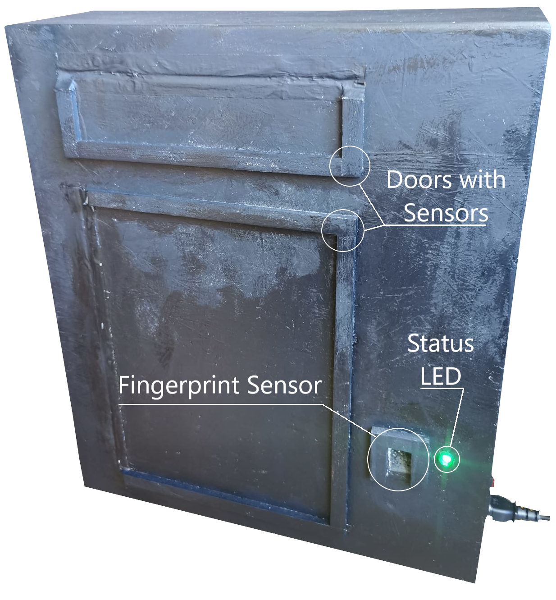
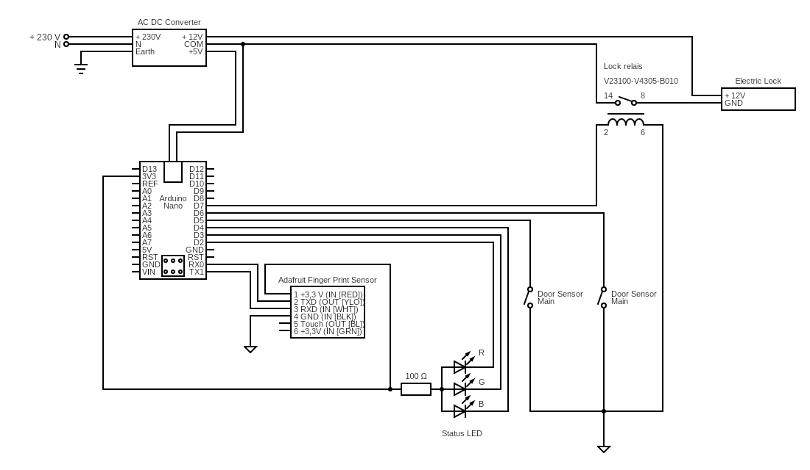
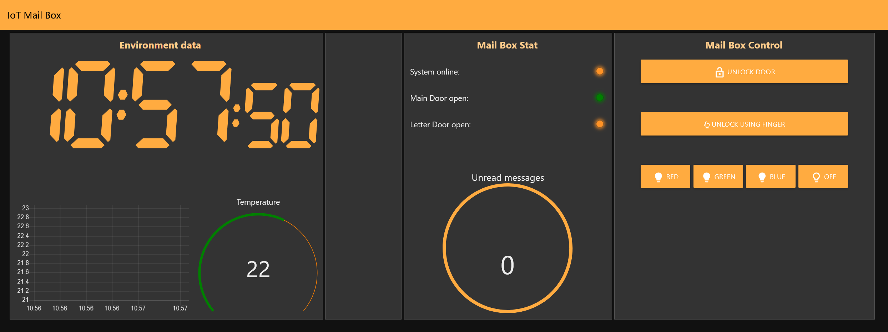

# Project: IoT Smart Letterbox

## Table of Contents
- [Description](#description)
- [Setup](#setup)
  - [Hardware](#hardware)
  - [Required Credentials](#required-credentials)
  - [Start Node-RED](#start-node-red)
- [Circuit Diagram](#circuit-diagram)
- [Node-RED Dashboard](#node-red-dashboard)

## Description

The project is a smart letterbox that can be opened and closed remotely or via a finger print sensor. The letterbox is equipped with a Arduino Connect RP 2040 and can be controlled via a Node-RED dashboard.



## Setup

### Hardware
For the project the following hardware is required:
- Arduino Connect RP 2040
- Finger print sensor (Adafruit Fingerprint Sensor: https://www.adafruit.com/product/751)
- Electric door lock
- 12V power supply
- Relay

### Required Credentials
To connect the application to the network and to a desired MQTT broker you need to create a file called `credentials.h` in the `src/lib` directory. The file should contain the following defines:

```c++
#define WIFI_SSID       "YOUR_WIFI_SSID"
#define WIFI_PASSWORD   "YOUR_WIFI_PASSWORD"

#define MQTT_SERVER     "YOUR_MQTT_SERVER"    // e.g. "HiveMQ.com"
#define MQTT_PORT       "YOUR_MQTT_PORT"      // e.g. "1883" or "8883" for SSL
#define MQTT_CLIENT_ID  "YOUR_MQTT_CLIENT_ID"
#define MQTT_USERNAME   "YOUR_MQTT_USERNAME"
#define MQTT_PASSWORD   "YOUR_MQTT_PASSWORD"
```

### Start Node-RED
Running Node-RED on a Windows machine will lead to a failure because Windows suppresses script execution by default. To enable script execution, run the following command in a PowerShell:
```powershell
powershell -ExecutionPolicy Bypass node-red
```

## Circuit Diagram
The following circuit diagram shows the wiring of the components.


## Node-RED Dashboard
The following screenshot shows the Node-RED dashboard.

The dashboard Node-RED flow can be found in the [node-red](src/node-red/) directory.